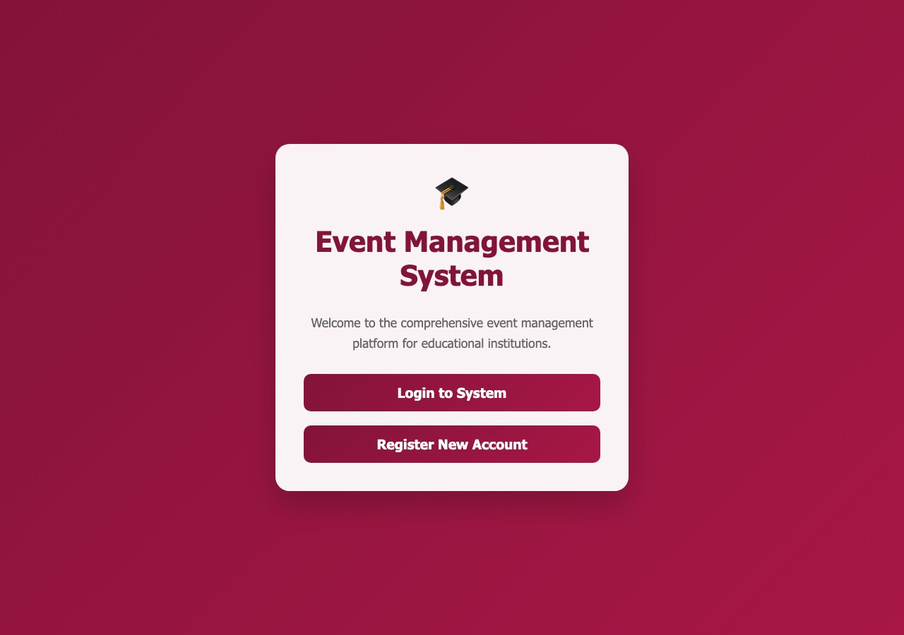
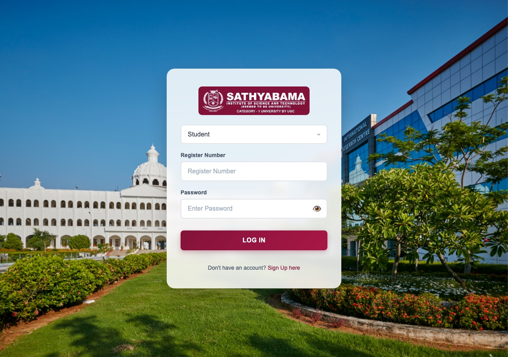
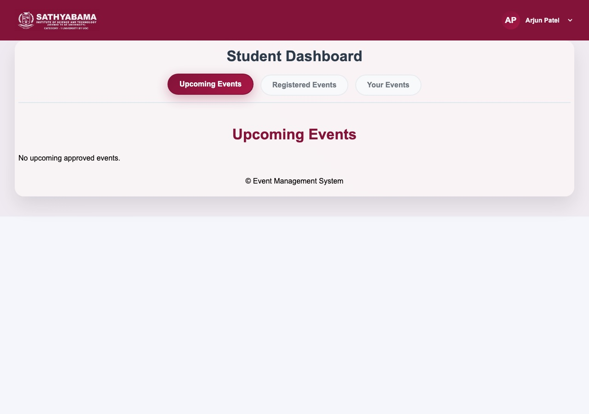
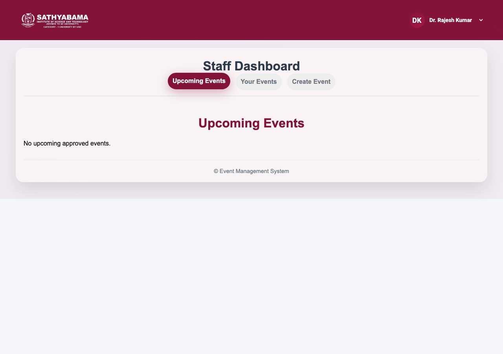
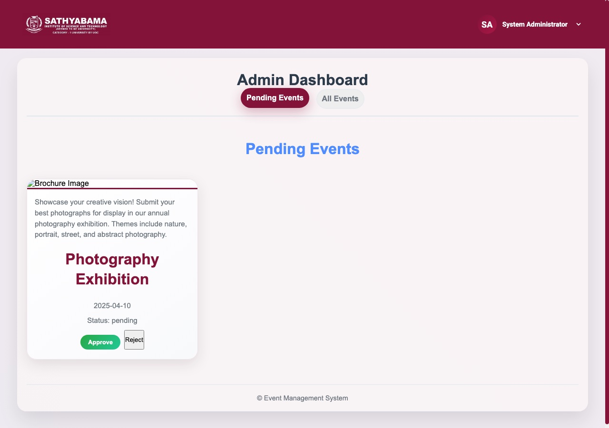

# Event Management System

A PHP-based event management platform for educational institutions, with role-based dashboards for **students**, **staff**, and **admins**, a MySQL backend, and a companion Spring Boot email microservice for registration confirmations.

## Screenshots

| Landing Page | Login |
|---|---|
|  |  |

| Student Dashboard | Staff Dashboard |
|---|---|
|  |  |

**Admin Dashboard** — event approval workflow



## Features

- **Role-based access**: separate dashboards for students, staff (event coordinators), and admins
- **Event lifecycle**: staff create events → admin approves/rejects → students register
- **Registration management**: capacity limits, registration status, "closed" state once full
- **Email notifications**: registration confirmations via a Spring Boot microservice (or local preview mode for development)
- **Secure auth**: hashed passwords (`password_hash`/`password_verify`), prepared statements throughout

## Tech Stack

- **Backend**: PHP (mysqli, prepared statements)
- **Database**: MySQL / MariaDB
- **Email service**: Java, Spring Boot ([java-email-service](java-email-service))
- **Frontend**: HTML/CSS/vanilla JS

## Getting Started

See [Documentation/README.md](Documentation/README.md) for full setup instructions (database import, web server configuration, and sample login credentials).

## Project Structure

```
EventManagementSystem/
├── Admin/            # Admin dashboard + event approval endpoints
├── Staff/             # Staff dashboard + event creation endpoints
├── Student/           # Student dashboard + registration endpoints
├── Login/ Register/   # Authentication
├── API/               # Shared API endpoints
├── Config/            # Email service configuration
├── Database/          # Schema + connection helper
├── java-email-service/# Spring Boot email microservice
└── Documentation/      # Detailed setup docs
```

## License

Not currently licensed for reuse — contact the repo owner if you'd like to use this project.
